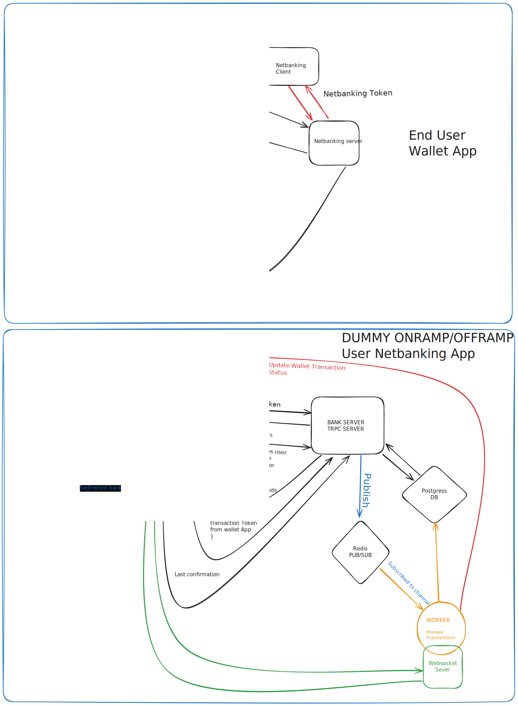

## High Level Design

## Demo

[WALLET.webm](https://walletapp.wdd12-jasveer.xyz/transfer)

## Features

1.  SignUp/SignIn.
2.  Automatic SIGNUP on NETBANKING-APP.
3.  Session based login using NextAuth.
4.  OnRamp/OffRamp fake money from fake/to netbanking frontend and server.
5.  Peer-2-Peer Transfer in app.
6.  See OnRamp and OffRamp Transactions.
7.  Transaction Status updates using Websocket server.

## Stack

🧰 **Turbo Repo:** Efficient monorepo management, enabling streamlined development and easy scalability.

🔄 **WebSocket, React, Next.js:** Real-time updates ensure that users receive instant notifications of their transactions. The dynamic and responsive UI built with React and Next.js enhances the user experience with fast loading times and smooth navigation.

🌐 **Express:** A robust backend framework used to build our webhook server, ensuring reliable handling of transaction updates and secure communication between services.

🛠️ **Prisma:** A powerful ORM that simplifies database management with type-safe queries, making it easier to handle complex database operations and maintain data integrity.

💻 **TypeScript:** Provides a type-safe codebase that helps catch errors early in the development process, improving code quality and maintainability.

🐳 **Docker & Docker Compose:** Simplified development, testing, and deployment by containerizing applications, ensuring consistent environments across all stages of the development lifecycle.

☁️ **AWS EC2:** Scalable and secure cloud hosting that ensures high availability and performance, allowing the app to handle a growing number of users and transactions seamlessly.

🔄 **CI/CD Pipeline:** An automated deployment process that facilitates continuous integration and delivery, ensuring that new features and updates are deployed quickly and reliably.

🎨 **Tailwind CSS:** A utility-first CSS framework that helps create elegant and responsive UI designs, making the app visually appealing and user-friendly.

## CI/CD jobs

1.  On pull requests build job will be run.
2.  On push to main branch it will be pushed docker image.
3.  On push to main branch it will push new docker image and pull on ec2 server and will start the app via docker compose.
