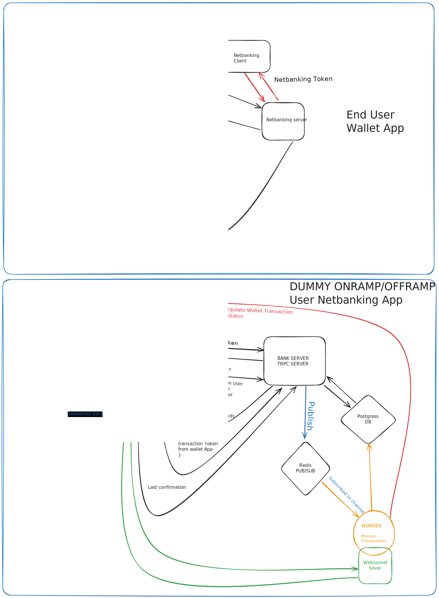

## High-Level Design

## Demo

Check out a live demo of the wallet application in action:

- **[View the Demo](https://walletapp.wdd12-jasveer.xyz/transfer)**
- 

## Project Overview: Wallet Application

The Wallet Application is a full-stack financial platform that simulates real-world banking operations, enabling users to manage accounts, process transactions, and track financial activity in real-time. Built with a modular, scalable architecture, the project features a robust and secure user experience, real-time updates, and seamless integration with a simulated banking system.

## Key Features

1. **SignUp/SignIn**: Secure user authentication for account creation and login.
2. **Automatic Sign-Up on Netbanking**: Users are automatically registered with the simulated Netbanking app, creating a seamless onboarding experience.
3. **Session-based Login with NextAuth**: Provides secure session management to maintain persistent user sessions.
4. **OnRamp/OffRamp Transactions**: Users can simulate adding or withdrawing funds between their wallet and a netbanking service.
5. **Peer-to-Peer Transfers**: Users can transfer funds between one another securely and instantly.
6. **Transaction History**: View comprehensive records of all OnRamp and OffRamp transactions in the app.
7. **Real-Time Transaction Status Updates**: Powered by a WebSocket server, users receive instant updates on transaction statuses, ensuring a transparent and responsive experience.

## Design Patterns and Architectures

- **Module Pattern**: Applied across the project to expose specific methods and variables, promoting code reusability and maintainability.
- **Monorepo Architecture**: Managed with **Turbo Repo**, enabling seamless handling of multiple services, dependencies, and builds in a single codebase.
- **Singleton Pattern**: Utilized for managing database instances efficiently, ensuring that only one instance is used across the app.
- **WebSocket PUB/SUB Pattern**: Implemented for real-time communication across services, ensuring users get live transaction updates.
- **Component-Based Architecture**: Used in the frontend (React) to maintain clean, modular, and reusable UI components.

## Continuous Integration & Deployment (CI/CD)

Using **GitHub Actions**, I have implemented a robust CI/CD pipeline that automates the build and deployment process:

1. **Pull Request Builds**: Triggers automatic builds on pull requests to ensure code stability.
2. **Main Branch Pushes**: Automatically pushes Docker images to the registry and deploys them to AWS EC2 using Docker Compose.
3. **Automated Docker Deployments**: Upon every push to the main branch, a new Docker image is generated, pulled, and deployed on the EC2 server for seamless updates.

## Tech Stack

- 🧰 **Turbo Repo**: Monorepo management for efficient, scalable development.
- 🔄 **WebSocket, React, Next.js**: Real-time updates with a dynamic UI built using React and Next.js, enhancing user experience.
- 🌐 **Express**: A robust backend framework for handling transaction updates and secure communication between services.
- 🛠️ **Prisma**: Type-safe ORM for seamless database management, ensuring efficient and reliable data operations.
- 💻 **TypeScript**: Strongly-typed development environment for better error detection and improved code maintainability.
- 🐳 **Docker & Docker Compose**: Streamlined development, testing, and deployment through containerization, ensuring consistent environments.
- ☁️ **AWS EC2**: Secure and scalable cloud hosting to support growing user and transaction demands.
- 🎨 **Tailwind CSS**: A utility-first CSS framework that ensures a responsive and visually appealing design.
- 🔄 **NextAuth**: Manages secure session-based authentication, ensuring robust security protocols.

## Demo Credentials

### Demo User 1 Netbanking Credentials

- **Password**: 111

1. RBC: 5289851653
2. TD Bank: 5219234684
3. Scotiabank: 7061446466
4. BMO: 3478559388
5. CIBC: 0199517077
6. National Bank: 8731559051
7. HSBC: 6675206800

### Demo User 2 Netbanking Credentials

- **Password**: 111

1. RBC: 3432310083
2. TD Bank: 9998555863
3. Scotiabank: 1982012644
4. BMO: 8769761343
5. CIBC: 9877438946
6. National Bank: 8214251704
7. HSBC: 3132185213
